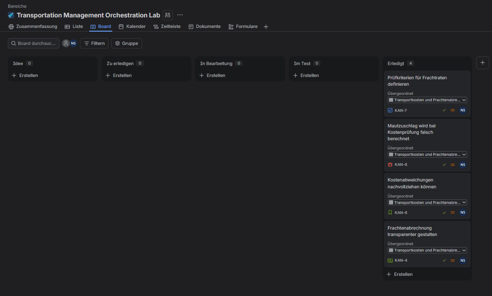
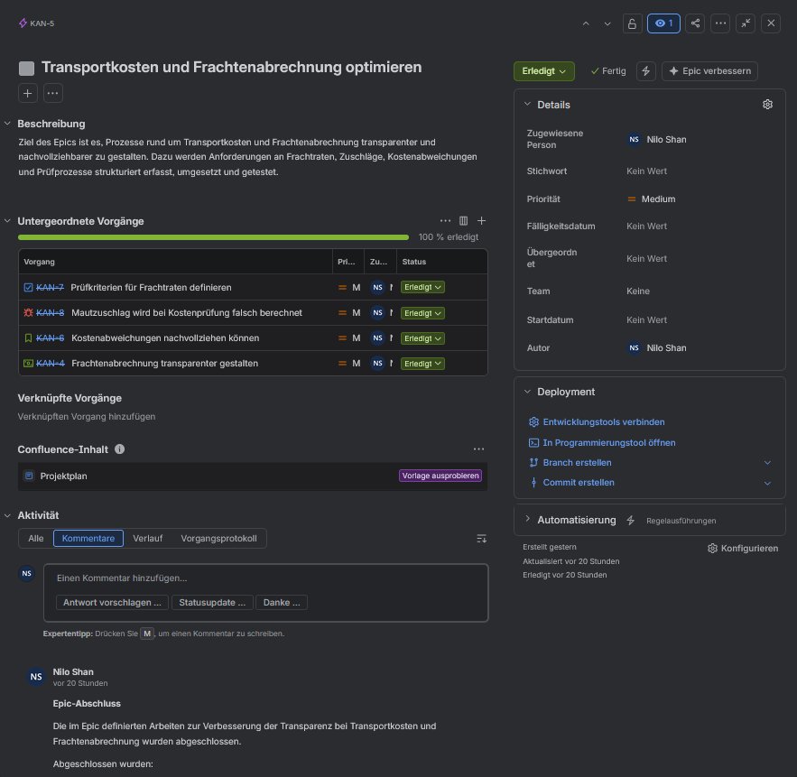
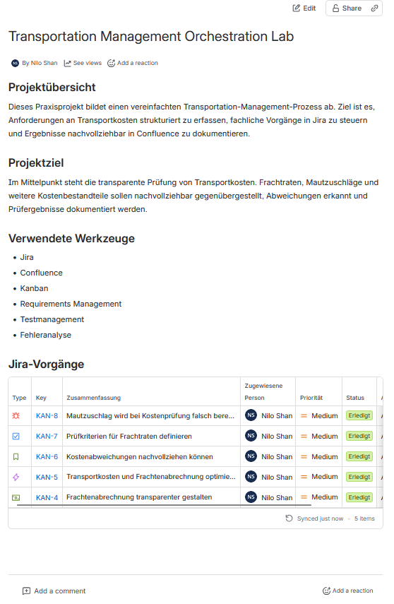
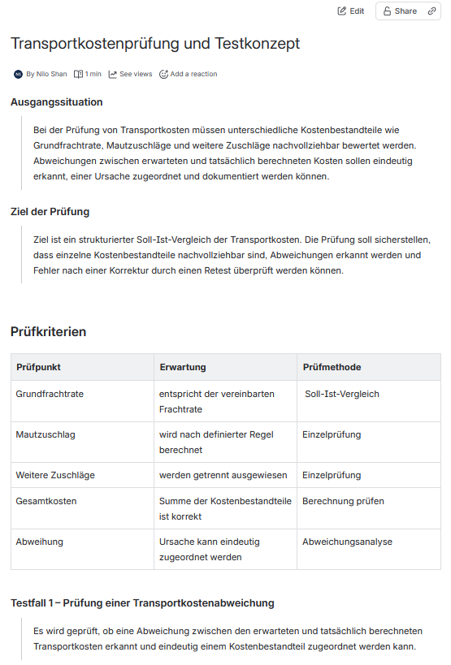
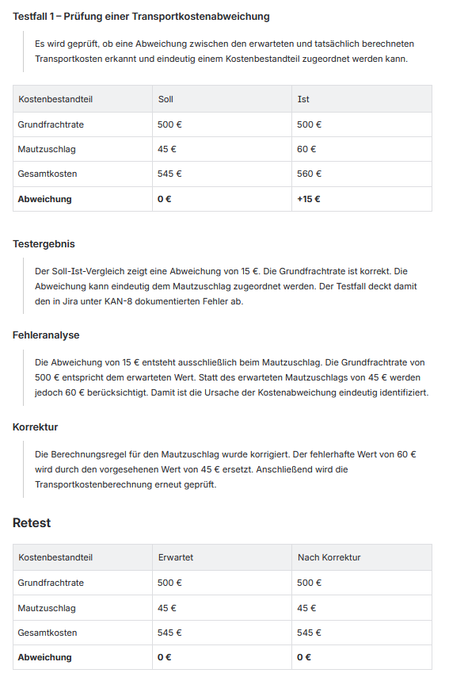

# Transportation Management Orchestration Lab

Praxisnahes Portfolio-Lab zur strukturierten Bearbeitung eines vereinfachten Transportation-Management-Prozesses mit Jira und Confluence.

Das Projekt zeigt, wie fachliche Anforderungen erfasst, über einen Kanban-Workflow gesteuert, anhand definierter Kriterien geprüft und nachvollziehbar dokumentiert werden können. Im Mittelpunkt steht ein fiktives Szenario zur Prüfung von Transportkosten mit Grundfrachtrate, Mautzuschlag und Soll-Ist-Abweichungen.

> **Hinweis:** Das Lab basiert auf einem eigenständig erstellten, fiktiven Szenario. Es werden keine internen oder proprietären Unternehmensdaten verwendet.

## Projektziel

Ziel des Labs ist ein durchgängiger Ablauf von der fachlichen Anforderung bis zum dokumentierten Testergebnis.

Dabei werden insbesondere folgende Arbeitsschritte abgebildet:

- Anforderungen strukturieren und in Jira erfassen
- Epic, Feature, Story, Task und Bug sinnvoll einsetzen
- Vorgänge über einen Kanban-Workflow steuern
- Akzeptanz- und Prüfkriterien definieren
- Transportkosten über Soll-Ist-Vergleiche prüfen
- Abweichungen analysieren und dokumentieren
- Korrekturen durch einen Retest verifizieren
- Jira-Vorgänge mit Confluence-Dokumentation verknüpfen

## Projektdokumentation

| Dokument | Inhalt |
|---|---|
| [Prozessbeschreibung](docs/process-description.md) | Kanban-Workflow, Jira-Vorgangstypen und Bearbeitungsprozess |
| [Testkonzept](docs/test-concept.md) | Prüfkriterien, Soll-Ist-Vergleich, Fehleranalyse und Retest |
| [Fachliche Anforderungen](requirements/transport-cost-requirements.md) | REQ-001 bis REQ-006 und Traceability Matrix |
| [Testfall TC-001](test-cases/TC-001-transport-cost-variance.md) | Konkreter Testfall zur Transportkostenabweichung |

## Eingesetzte Werkzeuge und Methoden

- Jira
- Confluence
- Kanban
- Anforderungsmanagement
- User Stories
- Akzeptanzkriterien
- Testmanagement
- funktionale Tests
- Soll-Ist-Vergleich
- Fehleranalyse
- Retest
- Traceability
- technische und fachliche Dokumentation

## Jira-Struktur

Für das Szenario wurden mehrere Jira-Vorgangstypen verwendet.

| Key | Typ | Beschreibung |
|---|---|---|
| `KAN-5` | Epic | Transportkosten und Frachtenabrechnung optimieren |
| `KAN-4` | Feature | Frachtenabrechnung transparenter gestalten |
| `KAN-6` | Story | Kostenabweichungen nachvollziehen können |
| `KAN-7` | Task | Prüfkriterien für Frachtraten definieren |
| `KAN-8` | Bug | Mautzuschlag wird bei Kostenprüfung falsch berechnet |

Der Epic bündelt den übergeordneten Themenbereich. Feature, Story, Task und Bug bilden unterschiedliche Arten der fachlichen Arbeit innerhalb des Labs ab.

## Kanban-Workflow

Die Vorgänge werden über einen definierten Workflow gesteuert:

**Idee → Zu erledigen → In Bearbeitung → Im Test → Erledigt**

| Status | Bedeutung |
|---|---|
| Idee | Eine neue Anforderung, Aufgabe oder ein Fehler wurde erfasst. |
| Zu erledigen | Der Vorgang wurde geprüft und zur Bearbeitung eingeplant. |
| In Bearbeitung | Die fachliche oder technische Bearbeitung läuft. |
| Im Test | Die Umsetzung beziehungsweise das Ergebnis wird anhand definierter Kriterien geprüft. |
| Erledigt | Bearbeitung und Prüfung wurden abgeschlossen. |

## Fachliche Anforderung

Die zentrale Story `KAN-6` beschreibt die Anforderung, Abweichungen zwischen erwarteten und tatsächlich berechneten Transportkosten nachvollziehen zu können.

Dafür wurden unter anderem folgende Akzeptanzkriterien definiert:

- Soll- und Ist-Kosten können gegenübergestellt werden.
- Abweichungen sind eindeutig erkennbar.
- Frachtraten und Zuschläge können getrennt geprüft werden.
- Die Ursache einer Abweichung kann dokumentiert werden.
- Prüfergebnisse bleiben für andere Beteiligte nachvollziehbar.

Die detaillierten Anforderungen sind in [transport-cost-requirements.md](requirements/transport-cost-requirements.md) dokumentiert und über eine Traceability Matrix mit den Jira-Vorgängen und Testnachweisen verknüpft.

## Testszenario

Im Testszenario wird eine fehlerhafte Berechnung des Mautzuschlags geprüft.

| Kostenbestandteil | Soll | Ist |
|---|---:|---:|
| Grundfrachtrate | 500 EUR | 500 EUR |
| Mautzuschlag | 45 EUR | 60 EUR |
| Gesamtkosten | 545 EUR | 560 EUR |
| Abweichung | 0 EUR | +15 EUR |

Der Soll-Ist-Vergleich zeigt eine Abweichung von **15 EUR**. Die Grundfrachtrate ist korrekt, sodass die Differenz eindeutig dem Mautzuschlag zugeordnet werden kann.

Der konkrete Ablauf ist im [Testfall TC-001](test-cases/TC-001-transport-cost-variance.md) dokumentiert.

## Fehleranalyse und Retest

Der festgestellte Fehler wurde als `KAN-8` erfasst und anhand von Soll-Verhalten, Ist-Verhalten, Reproduktionsschritten und Fehlerursache dokumentiert.

Im fiktiven Testszenario wird die Berechnungsregel anschließend so korrigiert, dass der vorgesehene Mautzuschlag von 45 EUR berücksichtigt wird.

Der Retest ergibt:

| Kostenbestandteil | Erwartet | Nach Korrektur |
|---|---:|---:|
| Grundfrachtrate | 500 EUR | 500 EUR |
| Mautzuschlag | 45 EUR | 45 EUR |
| Gesamtkosten | 545 EUR | 545 EUR |
| Abweichung | 0 EUR | 0 EUR |

**Retest-Ergebnis: Bestanden**

Die Soll- und Ist-Werte stimmen nach der Korrektur überein. Der zuvor dokumentierte Fehler tritt im Retest nicht erneut auf.

## Zusammenspiel von Jira und Confluence

Jira wird im Lab für die operative Vorgangssteuerung eingesetzt. Anforderungen, Aufgaben und Fehler werden dort erfasst, bearbeitet, getestet und abgeschlossen.

Confluence ergänzt diesen Ablauf um die fachliche Dokumentation. Dort werden unter anderem Prüfkriterien, Testfälle, Soll-Ist-Vergleiche, Fehleranalysen und Retest-Ergebnisse festgehalten.

Relevante Jira-Vorgänge sind in die Confluence-Seiten eingebunden. Dadurch bleiben Bearbeitungsstatus und fachlicher Nachweis miteinander verknüpft.

## Projektnachweise

### Jira Kanban-Board

Das Board zeigt den verwendeten Workflow und die abgeschlossenen Vorgänge.



### Abgeschlossener Epic

Der Epic `KAN-5` ist vollständig abgeschlossen. Die zugehörigen Vorgänge befinden sich im Status **Erledigt**.



### Confluence Projektübersicht

Die zentrale Projektseite dokumentiert Ziel, eingesetzte Werkzeuge und die eingebundenen Jira-Vorgänge.



### Prüfkriterien und Testkonzept

Die fachlichen Prüfkriterien für Grundfrachtrate, Mautzuschlag, weitere Zuschläge, Gesamtkosten und Abweichungen sind strukturiert dokumentiert.



### Soll-Ist-Vergleich, Fehleranalyse und Retest

Der dokumentierte Testfall zeigt die Abweichung von 15 EUR, die Fehleranalyse, die Korrektur im Testszenario und den erfolgreichen Retest.



## Nachverfolgbarkeit

Das Lab bildet folgende Kette nachvollziehbar ab:

**Fachliche Anforderung → Jira-Vorgang → Prüfkriterium → Testfall → Fehleranalyse → Korrektur → Retest → Dokumentation**

Die Verbindung zwischen Anforderungen, Jira-Vorgängen und Testnachweisen ist zusätzlich in der [Traceability Matrix](requirements/transport-cost-requirements.md#traceability-matrix) dokumentiert.

## Repository-Struktur

```text
transport-management-orchestration-lab/
├── README.md
├── docs/
│   ├── process-description.md
│   ├── test-concept.md
│   └── screenshots/
├── requirements/
│   └── transport-cost-requirements.md
└── test-cases/
    └── TC-001-transport-cost-variance.md
```

## Im Projekt angewendete Kenntnisse

Das Portfolio-Lab dokumentiert praktische Arbeit mit Jira und Confluence sowie Grundlagen aus Anforderungsmanagement, Testmanagement und strukturierter Prozessdokumentation.

Besonders sichtbar werden dabei:

- strukturierte Vorgangssteuerung mit Jira
- Arbeit mit Epic, Feature, Story, Task und Bug
- Kanban-basierte Bearbeitungsprozesse
- Definition prüfbarer Anforderungen und Akzeptanzkriterien
- funktionale Tests und Soll-Ist-Vergleiche
- strukturierte Fehleranalyse
- Retesting nach einer Korrektur
- Traceability zwischen Anforderungen und Tests
- Jira-Confluence-Verknüpfungen
- nachvollziehbare fachliche Dokumentation

## Projektstatus

Das definierte Szenario wurde vollständig bearbeitet.

Alle vorgesehenen Jira-Vorgänge wurden durch den Workflow geführt und abgeschlossen. Die zugehörige fachliche Dokumentation, die Anforderungen sowie der Testfall wurden zusätzlich im Repository dokumentiert.

Das Repository dient damit als kompakter Praxisnachweis für die strukturierte Arbeit an der Schnittstelle zwischen Transportation Management, IT-Prozessen, Anforderungsmanagement und Softwaretests.
